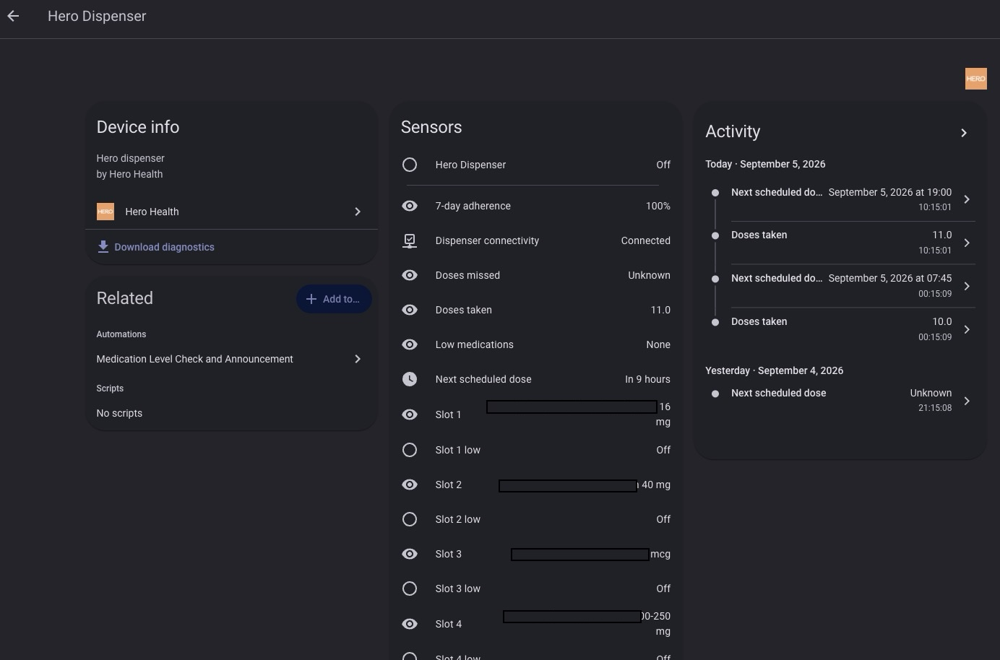

  

<h1 align="center">Hero Health for Home Assistant</h1>

  An easy, user-friendly Home Assistant integration for the <strong>Hero medication dispenser</strong>.

  
  
  
  

---

## What this integration does

This custom integration brings your **Hero medication dispenser** into Home Assistant so you can keep an eye on your device and medication-related status right from your dashboard.

It gives you a simple Home Assistant view of:

- dispenser connectivity
- next scheduled dose
- doses taken
- doses missed
- 7-day adherence
- low-medication warnings
- medication slot status and levels

It is designed to feel native in Home Assistant and make it easier to build dashboards, helpers, and automations around your Hero dispenser.

---

## Screenshot

  

---

## Features

### Device overview
See your Hero dispenser as a Home Assistant device, including helpful device details surfaced by the integration.

### Helpful sensors
The integration creates sensors for the most useful everyday information, including:

- **Next scheduled dose**
- **Doses taken**
- **Doses missed**
- **7-day adherence**
- **Dispenser connectivity**
- **Low medications**
- **Per-slot medication details**
- **Per-slot low medication alerts**

### Smarter next scheduled dose
The integration uses Hero’s live data first for the next scheduled dose.

If Hero’s live window does not currently include a future dose, the integration can still show the next scheduled time using the dispenser’s recurring weekly schedule so the sensor stays useful throughout the day.

### Dashboard and automation friendly
All entities are available like any other Home Assistant integration, making them easy to use in:

- dashboards
- automations
- template sensors
- notifications
- health-related helper views

---

## Installation

### Install with HACS (recommended)

1. Open **HACS**
2. Go to **Integrations**
3. Select the three-dot menu and choose **Custom repositories**
4. Add this repository:

   `https://github.com/andrewtryder/ha-herohealth`

5. Choose **Integration** as the category
6. Click **Add**
7. Search for **Hero Health**
8. Install it
9. Restart Home Assistant

Or click below to open HACS directly:

  

---

## Setup

After installation:

1. Open **Settings**
2. Go to **Devices & Services**
3. Click **Add Integration**
4. Search for **Hero Health**
5. Sign in with your Hero account
6. Finish setup

Once configured, your Hero dispenser and related sensors will appear in Home Assistant automatically.

---

## What you’ll see in Home Assistant

Depending on your dispenser configuration, you may see entities such as:

- `sensor.hero_health_next_scheduled_dose`
- `sensor.hero_health_doses_taken`
- `sensor.hero_health_doses_missed`
- `sensor.hero_health_7_day_adherence`
- `sensor.hero_health_medications`
- `sensor.hero_health_low_medications`
- `binary_sensor.hero_health_dispenser_connectivity`
- `binary_sensor.hero_health_dispense_available`
- `button.hero_health_dispense_scheduled_dose`

You’ll also get entities for individual medication slots.

---

## Safety & Remote Dispensing

The integration includes a safety-gated button entity (`button.hero_health_dispense_scheduled_dose`) and an administrative action (`hero_health.dispense_scheduled_dose`):

- **Strict Eligibility Window**: A dose can only be dispensed starting 30 minutes before its scheduled time up to 6 hours after, matching Hero's physical dispenser rules.
- **Admin-Gated Execution**: Remote dispensing is restricted to Home Assistant administrators for safety.
- **Durable Idempotency Journal**: Dispenses are recorded in durable storage to prevent duplicate dispenses across restarts and reloads.
- **Fail-Closed Ambiguity Handling**: If communication drops after a dispense start frame has been sent, the dose state is flagged as unknown and subsequent remote dispenses for that time are blocked until dispenser state is physically verified.
- **Observability Without Polling**: Availability sensors and buttons schedule precise local timers at window open/close boundaries so dashboard badges and buttons update in real time without polling the cloud.

---

## Privacy & Database Storage

Home Assistant's recorder stores entity state changes over time. To protect sensitive medication information and keep your database performant:

- Detailed medication lists, names, and slot compositions are marked unrecorded in state attributes (`_unrecorded_attributes`), keeping medication names out of long-term history logs.
- Diagnostic downloads automatically sanitize credentials, tokens, account identifiers, and private health data.

---

## Removal

To uninstall the integration:
1. Navigate to **Settings** -> **Devices & Services** -> **Hero Health**.
2. Click the three-dot menu and select **Delete**.
3. All local session stores, cached tokens, and entities will be removed immediately.

---

## Great uses for this integration

This integration works especially well for:

- showing medication status on a family dashboard
- sending reminders when doses are coming up
- alerting when medications are low
- monitoring dispenser connectivity
- building simple caregiver-friendly views in Home Assistant

---

## Notes

- This is an **unofficial** Home Assistant integration for Hero.
- It is intended to make Hero information easier to view inside Home Assistant.
- Some values depend on the information currently available from Hero.

---

## Support

If you run into problems or want to request a feature, please open an issue here:

[GitHub Issues](https://github.com/andrewtryder/ha-herohealth/issues)

---

## Disclaimer

Hero and Hero Health are the property of their respective owner.
This project is an independent, unofficial integration and is not affiliated with or endorsed by Hero Health.
